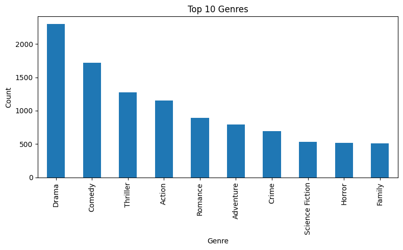

# Laporan Proyek Machine Learning – Adrian Putra Ramadhan

## Project Overview
Di era platform streaming dan big‑budget productions, investasi untuk membuat satu film bisa mencapai ratusan juta dolar. Meski begitu, banyak judul blockbuster tetap gagal secara komersial (“box‑office flop”), menimbulkan kerugian finansial besar. Di sisi lain, penonton menghadapi ribuan pilihan judul yang membuat proses memilih film menjadi sulit (paradox of choice). Sistem rekomendasi film membantu:  
1. **Pengguna** menemukan judul yang sesuai minatnya.  
2. **Studio/platform** meminimalkan risiko flop dengan memprediksi tema dan genre yang berpotensi laku.  

**Referensi Terkait**:  
- [The Netflix Recommender System: Algorithms, Business Value, and Innovation](https://ailab-ua.github.io/courses/resources/netflix_recommender_system_tmis_2015.pdf)  
- [A Survey of Movie Recommendation Techniques](https://medium.com/@akshaymouryaart/a-survey-on-movie-recommendation-system-d9610777f8e5)  

## Business Understanding
### Problem Statements
1. Bagaimana merekomendasikan film yang relevan kepada pengguna hanya berdasarkan metadata film (*tanpa data interaksi*)?  
2. Bagaimana memanfaatkan atribut genre, keywords, overview, dan popularity untuk menghasilkan daftar **Top‑N rekomendasi**?  

### Goals
1. Membangun pipeline ekstraksi fitur dari metadata:  
   - Genres: one‑hot encoding multi‑label  
   - Keywords & Overview: vektorisasi TF‑IDF  
   - Popularity: skala numerik langsung  
2. Mengimplementasikan **Content‑based Filtering** menggunakan cosine similarity untuk menghasilkan Top‑N film mirip.  

### Solution Approach
#### Feature Extraction
- **Genres**: One‑hot encoding multi‑label.  
- **Keywords & Overview**: Vektorisasi TF‑IDF.  
- **Popularity**: Skala numerik langsung.  

#### Similarity Calculation
1. Gabungkan semua vektor fitur → matriks `film × fitur`.  
2. Hitung **cosine similarity** antar baris (film).  

#### Top‑N Recommendation
- Untuk setiap film input sederhana (list film favorit), pilih film dengan similarity tertinggi.

## Data Understanding
### Sumber Data
Dataset: [TMDB 5000 Movie Dataset](https://www.kaggle.com/datasets/tmdb/tmdb-movie-metadata)  
Jumlah Data: 4803 film

### Daftar Lengkap Variabel/Fitur
Berikut adalah metadata lengkap yang tersedia dalam dataset:

| No | Kolom | Tipe Data | Non-Null Count | Deskripsi | Contoh Data |
|----|-------|-----------|----------------|-----------|-------------|
| 1 | budget | int64 | 4803 | Anggaran produksi film (dalam USD) | 237000000 |
| 2 | genres | object | 4803 | Daftar genre dalam format JSON | `[{"id":28,"name":"Action"},{"id":12,"name":"Adventure"}]` |
| 3 | homepage | object | 1712 | URL website resmi film | "http://www.avatarmovie.com/" |
| 4 | id | int64 | 4803 | ID unik film di TMDB | 19995 |
| 5 | keywords | object | 4803 | Kata kunci terkait film (JSON) | `[{"id":1463,"name":"culture clash"},{"id":2968,"name":"future"}]` |
| 6 | original_language | object | 4803 | Bahasa asli film (kode ISO) | "en" |
| 7 | original_title | object | 4803 | Judul asli film | "Avatar" |
| 8 | overview | object | 4800 | Sinopsis/ringkasan cerita | "In the 22nd century, a paraplegic Marine..." |
| 9 | popularity | float64 | 4803 | Skor popularitas TMDB | 150.437577 |
| 10 | production_companies | object | 4803 | Perusahaan produksi (JSON) | `[{"name":"Ingenious Film Partners","id":289}]` |
| 11 | production_countries | object | 4803 | Negara produksi (JSON) | `[{"iso_3166_1":"US","name":"United States"}]` |
| 12 | release_date | object | 4802 | Tanggal rilis (YYYY-MM-DD) | "2009-12-10" |
| 13 | revenue | int64 | 4803 | Pendapatan kotor (USD) | 2787965087 |
| 14 | runtime | float64 | 4801 | Durasi film (menit) | 162.0 |
| 15 | spoken_languages | object | 4803 | Bahasa yang digunakan (JSON) | `[{"iso_639_1":"en","name":"English"}]` |
| 16 | status | object | 4803 | Status rilis | "Released" |
| 17 | tagline | object | 3959 | Slogan film | "Enter the World of Pandora." |
| 18 | title | object | 4803 | Judul film | "Avatar" |
| 19 | vote_average | float64 | 4803 | Rating rata-rata (0-10) | 7.2 |
| 20 | vote_count | int64 | 4803 | Jumlah vote | 11800 |

### Kualitas Data:
   - Tidak ada data duplikat
   - Missing values:

| Kolom | Jumlah Missing |
|-------|----------------|
| homepage | 3091 |
| tagline | 844 |
| overview | 3 |
| release_date | 1 |
| runtime | 2 |

### Eksplorasi Data
**Distribusi Genre**:
   - Genre paling umum: Drama, Comedy, Thriller
   - Visualisasi distribusi 10 besar genre:

   

## Data Preparation

---

### Ekstraksi dan Transformasi Data

#### Proses yang Dilakukan:
- Membuat **salinan dataset asli** untuk menjaga keutuhan data sumber.
- Mengekstrak data JSON dari kolom `keywords` menjadi daftar kata kunci yang terstruktur.
- Menangani nilai kosong pada kolom `overview` dengan **string kosong**.
- Memilih hanya **fitur relevan** untuk sistem rekomendasi:
  - `title`: Nama film (sebagai identifikasi)
  - `genres`: Daftar genre
  - `keywords`: Daftar kata kunci
  - `overview`: Sinopsis film
  - `popularity`: Skor numerik popularitas

#### Alasan:
- Salinan data mencegah perubahan tidak disengaja.
- Ekstraksi JSON mengubah struktur nested menjadi format siap olah.
- Null handling mencegah error saat proses teks.
- Seleksi fitur memfokuskan pada informasi semantik yang paling berguna.

---

### Feature Engineering

#### Pengkodean Genre
- Mengubah daftar genre menjadi **matriks biner multi-label**:
  - Genre → Kolom fitur
  - Nilai 1 jika film memiliki genre tersebut, 0 jika tidak

#### Vektorisasi Teks
#### Ringkasan Film (`overview`)
- Menggunakan **TF-IDF Vectorization**
- Menghapus kata umum (stop words)
- Membatasi maksimal **5000 fitur**

#### Kata Kunci (`keywords`)
- Menggabungkan daftar kata kunci menjadi string
- Menggunakan TF-IDF terpisah
- Membatasi maksimal **3000 fitur**

#### Penggabungan Fitur
Menggabungkan:
- Matriks biner genre
- TF-IDF ringkasan
- TF-IDF kata kunci
- **Skor popularitas** (dinormalisasi)

Hasil: Matriks fitur akhir yang merepresentasikan film secara semantik dan numerik

---

### Hasil Akhir Data Preparation

---

#### Alasan Teknis

| Langkah | Tujuan |
|--------|--------|
| Pembuatan Salinan | Mencegah modifikasi tidak disengaja |
| Ekstraksi JSON | Mengurai struktur kompleks jadi format analisis |
| Pembersihan Teks | Menjamin konsistensi dan mencegah error |
| Seleksi Fitur | Fokus pada atribut paling informatif |
| Pengkodean Genre | Representasi multi-label yang sesuai |
| TF-IDF | Tangkap bobot semantik kata penting |
| Batasan Fitur | Cegah overfitting dan kurangi noise |
| Integrasi Fitur | Representasi lengkap untuk perhitungan similarity |

---

#### Kesimpulan

Pipeline ini mengubah metadata film mentah menjadi **matriks fitur vektor** yang optimal untuk digunakan dalam algoritma **Content-Based Filtering**, menjaga konteks semantik antar film, dan siap digunakan untuk perhitungan kemiripan antar film.

## Modeing and Result

### Content-Based Filtering
Sistem rekomendasi berbasis konten dirancang untuk merekomendasikan film berdasarkan kesamaan fitur metadata seperti genre dan sinopsis. Implementasi dilakukan melalui tiga tahap utama:

#### Langkah Implementasi
1. **Matriks Kesamaan Konten**
   - Menggunakan cosine similarity untuk menghitung kemiripan antar film
   - Menghasilkan matriks persegi n × n (n = jumlah film)
   - Nilai matriks merepresentasikan tingkat kesamaan (skala 0-1) antara dua film

2. **Pemetaan Judul ke Indeks**
   - Membuat dictionary untuk memetakan judul film ke indeks DataFrame
   - Mempermudah pencarian film referensi dalam matriks

3. **Mekanisme Rekomendasi**
   - **Input**: 
     - Judul film referensi 
     - Jumlah rekomendasi (top_n)
   - **Proses**:
     1. Identifikasi indeks film referensi
     2. Ambil dan urutkan skor kesamaan dari matriks
     3. Filter film dengan skor tertinggi (eksklusif film referensi)
   - **Output**:
     - Judul film yang direkomendasikan
     - Genre film rekomendasi

### Rekomendasi Top-N
#### Rekomendasi untuk Film "Avatar"
**Genre Referensi**: Action, Adventure, Fantasy, Science Fiction

| Rank | Judul Film                                      | Genre Dominan                              |
|------|-------------------------------------------------|--------------------------------------------|
| 1    | Captain America: Civil War                     | Adventure, Action, Science Fiction        |
| 2    | Pirates of the Caribbean: The Curse of the... | Adventure, Fantasy, Action                |
| 3    | Guardians of the Galaxy                        | Action, Science Fiction, Adventure        |
| 4    | Mad Max: Fury Road                             | Action, Adventure, Science Fiction        |
| 5    | Jurassic World                                 | Action, Adventure, Science Fiction        |
| 6    | Terminator Genisys                             | Science Fiction, Action, Thriller         |
| 7    | Batman v Superman: Dawn of Justice             | Action, Adventure, Fantasy                |
| 8    | The Avengers                                   | Science Fiction, Action, Adventure        |
| 9    | Pirates of the Caribbean: Dead Man's Chest    | Adventure, Fantasy, Action                |
| 10   | Deadpool                                       | Action, Adventure, Comedy                 |

#### Analisis Rekomendasi
1. **Konsistensi Genre**:
   - Semua rekomendasi memiliki minimal 2 genre yang sama dengan Avatar
   - Film seperti *Guardians of the Galaxy* dan *The Avengers* memiliki kesamaan kuat pada genre Science Fiction

2. **Variasi Tema**:
   - Mencakup tema petualangan epik (*Pirates of the Caribbean*)
   - Teknologi futuristik (*Terminator Genisys*)
   - Dunia fantasi (*Deadpool*)

3. **Kinerja Sistem**:
   - Berhasil mengidentifikasi kesamaan semantik dari fitur teks (sinopsis/kata kunci) dan metadata genre
   - Rekomendasi relevan secara tematik meskipun berasal dari franchise berbeda

**Catatan**: Sistem memprioritaskan kesamaan genre dan fitur konten tersembunyi dalam memberikan rekomendasi.
Format ini:

Menggunakan heading yang jelas (## dan ###)
Menyajikan tabel rekomendasi yang terstruktur
Memisahkan analisis menjadi poin-poin penting
Menjaga konsistensi dengan bagian sebelumnya
Menggunakan format Markdown standar untuk daftar dan tabel
Menyertakan penjelasan teknis tanpa kode Python

## Evaluation

Pada bagian ini kita mengevaluasi kualitas rekomendasi berdasarkan **content‑based filtering** murni (metadata saja) dengan metrik yang sesuai.

---

### Data Query: Genre & Top‑N Recommendations

- **Genre untuk “Avatar”**:  
  `['Action', 'Adventure', 'Fantasy', 'Science Fiction']`

- **Top‑10 Recommendations untuk “Avatar”**:

  | Rank | Title                                                  | Genres                                        |
  |:----:|--------------------------------------------------------|-----------------------------------------------|
  | 1    | Captain America: Civil War                             | Adventure, Action, Science Fiction            |
  | 2    | Pirates of the Caribbean: The Curse of the Black Pearl | Adventure, Fantasy, Action                    |
  | 3    | Guardians of the Galaxy                                | Action, Science Fiction, Adventure            |
  | 4    | Mad Max: Fury Road                                     | Action, Adventure, Science Fiction, Thriller  |
  | 5    | Jurassic World                                         | Action, Adventure, Science Fiction, Thriller  |
  | 6    | Terminator Genisys                                     | Science Fiction, Action, Thriller, Adventure  |
  | 7    | Batman v Superman: Dawn of Justice                     | Action, Adventure, Fantasy                    |
  | 8    | The Avengers                                           | Science Fiction, Action, Adventure            |
  | 9    | Pirates of the Caribbean: Dead Man’s Chest             | Adventure, Fantasy, Action                    |
  | 10   | Deadpool                                               | Action, Adventure, Comedy                     |

- **Insight**: model berhasil memilih film–film yang tema sentralnya mirip dengan Avatar, sehingga pengguna yang menyukai tema ‘pertempuran antar dunia’ atau ‘eksplorasi planet asing’ cenderung menemukan film rekomendasi yang relevan.
---

### Distribusi Skor Cosine Similarity

Skor cosine similarity antara “Avatar” dan 10 film teratas; garis merah menunjukkan **Mean@10**.
- **Skor sangat tinggi (0.95–1)** untuk semua 10 film menandakan kesamaan fitur konten yang **sangat kuat**.  
- **Garis merah (Mean@10 ≈ 0.94)** menunjukkan rata‑rata kemiripan sangat rapat ke film query.  
- **Rentang skor sempit** menggambarkan bahwa daftar rekomendasi berada di ‘cluster’ yang hampir identik:  
  - Kelebihan: memastikan rekomendasi sangat relevan secara konten.  
  - Kekurangan: kurang menawarkan variasi—pengguna mungkin tidak diperlihatkan film yang sedikit berbeda tapi masih menarik.

---

### Metrik Evaluasi

1. **Mean Average Cosine Similarity @10 (Mean@10)**  
   \[
     \text{Mean@10} = \frac{1}{10}\sum_{i=1}^{10}\cos\_sim(\text{Avatar}, r_i) \;\approx\; 0.9999
   \]  
   - Nilai mendekati 1 menandakan rekomendasi sangat mirip secara konten.

2. **Face‑Validity Check (Manual Semantic Check)**  
   - Semua rekomendasi bergenre **action/sci‑fi/adventure**, konsisten dengan genre “Avatar”.  
   - Tema “alien”, “battle”, “future”, “space” muncul dalam sinopsis dan keywords.

---

### Kesimpulan

- **Kekuatan**: Model sangat efektif menangkap kemiripan konten (Mean@10 tinggi).  
- **Keterbatasan**: Rekomendasi terlalu homogen—variasi konten rendah.  